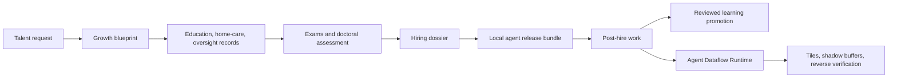

# AI Talent Foundry

[한국어 README](README.ko.md)

AI Talent Foundry is a local-first experimental agent foundry. It turns an AI talent request into growth records, exams, institutional review, doctoral-style assessment, hiring dossier, local release bundle, post-hire work, and quality-gated learning.

This public repository is a selected export of the local 22B-AI workspace. It intentionally excludes private data, voice assets, generated runs, model checkpoints, local absolute paths, and personal workspace logs.

## Architecture



## Quick Start

```powershell
.\scripts\run_tests.ps1
.\scripts\run_doctor.ps1
.\scripts\run_talent_foundry_demo.ps1
.\scripts\check_public_repo_hygiene.ps1
```

## Agent Dataflow Runtime

The Dataflow Runtime adapts chip-level data movement ideas into a software agent execution pattern. It formats a job, routes only active memory, splits work into task tiles, stores tile results in shadow buffers, synthesizes a report, reverse-verifies conclusions against evidence, and proposes growth only after review.

Release bundles expose it through:

```powershell
powershell -ExecutionPolicy Bypass -File .\run_dataflow_job.ps1 -JobSpec .\dataflow_job.template.json -Score 94 -ReviewedBy "Boss"
```

## Docs

- [AI Talent Foundry details](apps/ai-talent-foundry/README.en.md)
- [Korean public release hygiene checklist](docs/40_public_release_hygiene_ko.md)
- [Agent Dataflow Runtime design](docs/superpowers/specs/2026-05-30-agent-dataflow-runtime-design.md)

## Security

- Local-first by default.
- Investment execution, unapproved external upload, and private reasoning-trace export are blocked.
- Run `check_public_repo_hygiene.ps1` before publishing candidate files to GitHub.
