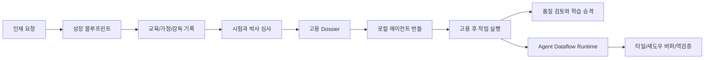

# AI Talent Foundry

[English README](README.en.md)

AI Talent Foundry는 로컬 컴퓨터에서 AI 인재를 설계하고, 성장 기록과 시험, 기관 심사, 박사 심사, 고용 계약, 고용 후 학습까지 파일로 검증하는 실험용 에이전트 파운드리입니다.

이 공개 레포는 22B-AI 작업 폴더 전체가 아니라, 공개 가능한 프로그램 코드와 문서만 선별한 버전입니다. 개인 데이터, 음성 자산, 생성 실행 결과, 모델 체크포인트, 로컬 절대경로는 포함하지 않습니다.

## 핵심 구조



## 바로 실행

```powershell
.\scripts\run_tests.ps1
.\scripts\run_doctor.ps1
.\scripts\run_talent_foundry_demo.ps1
.\scripts\check_public_repo_hygiene.ps1
```

## Agent Dataflow Runtime

Dataflow Runtime은 칩 수준의 데이터 이동 최적화 아이디어를 소프트웨어 에이전트 실행 구조로 옮긴 것입니다. 작업을 정규화하고, 현재 목표에 필요한 기억만 활성 캐시에 올린 뒤, 업무 타일을 나눠 섀도우 버퍼에 결과를 쌓습니다. 마지막에는 결론을 타일 증거로 역추적해 검증하고, 검증된 실행만 성장 후보로 남깁니다.

배포 번들에서는 다음 진입점으로 실행합니다.

```powershell
powershell -ExecutionPolicy Bypass -File .\run_dataflow_job.ps1 -JobSpec .\dataflow_job.template.json -Score 94 -ReviewedBy "Boss"
```

## 문서

- [AI Talent Foundry 상세 설명](apps/ai-talent-foundry/README.ko.md)
- [공개 배포 위생 규칙](docs/40_public_release_hygiene_ko.md)
- [Agent Dataflow Runtime 설계](docs/superpowers/specs/2026-05-30-agent-dataflow-runtime-design.md)

## 보안 원칙

- 기본은 로컬 전용입니다.
- 투자 실행, 승인 없는 외부 업로드, 비공개 사고원문 저장을 차단합니다.
- GitHub 공개 전 `check_public_repo_hygiene.ps1`로 후보 파일을 검사합니다.
