# Agent Dataflow Runtime Design

## 한국어 요약

이 문서는 보스가 말한 테슬라식 AI 칩 벤치마킹을 22B-AI의 로컬 에이전트 실행 구조로 옮기기 위한 설계서입니다. 핵심은 하드웨어를 흉내 내는 것이 아니라, 데이터가 오래 이동하지 않게 하고, 업무를 바둑판형 타일로 나누며, 각 타일의 결과를 그림자 버퍼에 모은 뒤, 최종 결론을 역방향으로 검증하고, 검증된 경험만 신용이의 학습장부와 추론기풍에 반영하는 것입니다.

v1은 실제 병렬 실행보다 구조화된 순차 실행을 우선합니다. 로컬 PC의 안정성, 보안, 검증 가능성을 먼저 확보하고, 이후 분신/전문팀을 실제 병렬 작업자로 확장합니다. LLM은 신용이의 정체성이 아니라 응용 엔진이며, 정체성, 학적, 이력, 고용계약, 기억 정책, 추론기풍은 모두 로컬 산출물에 남습니다.

## 설계 상태

- 상태: 구현 전 설계안.
- 적용 위치: `src/ai22b/talent_foundry/dataflow_runtime.py` 신규 모듈 후보.
- 첫 CLI 후보: `run-hired-dataflow-job`.
- 첫 적용 분야: 신용이의 증권 리서치 에이전트.
- 구현 방식: 보스 리뷰 후 TDD로 진행.
- 원칙: 외부 업로드 없음, 비공개 사고흐름 저장 없음, 검증 전 성장 반영 없음.

## Purpose

Agent Dataflow Runtime is the execution layer that turns an employed AI talent into a practical local agent. The existing AI Talent Foundry can raise, assess, hire, package, install, and run agents. This design adds a Tesla/TPU-inspired dataflow layer above the current job, projection swarm, specialist team, memory, and learning-ledger modules.

The goal is not to imitate Tesla hardware literally. The useful principle is this: reduce long-distance data movement, keep task-relevant memory close to the worker, split work into bounded tiles, buffer intermediate results, verify the final result in reverse, and promote only verified experiences into future reasoning.

For Shin Yong and later talents, this means the LLM is only an application engine. Identity, training record, reasoning style, work contract, memory policy, tool permissions, and growth rules live in local files and are checked by the runtime.

## Research Basis

- Tesla Dojo Hot Chips 34: Dojo presents a physically and logically arranged 2D array, distributed SRAM, mesh communication, and software incentives to keep communication local. These ideas map well to task tiles, local active memory, and short-route evidence flow.
- Google TPU ISCA 2017: TPU uses a domain-specific matrix unit, large software-managed on-chip memory, and deterministic execution to improve latency and efficiency. This supports a deterministic local agent scheduler instead of an unbounded chat loop.
- OpenHands and OpenHands SDK: OpenHands separates SDK, tools, workspace, and server concerns, and supports local and sandboxed execution. This supports keeping AI Talent Foundry's runtime, workspace, tools, and packaging boundaries explicit.
- MemGPT: OS-style virtual context management moves information between memory tiers instead of stuffing everything into a single prompt. This supports active memory routing and cache-like job context.
- Voyager: lifelong agents can accumulate reusable skill libraries from successful tasks, reducing forgetting without necessarily fine-tuning weights. This supports a verified skill/reasoning ledger.
- Reflexion: agents can improve through verbal feedback and episodic memory buffers without changing model weights. This supports post-hire growth through reviewed work cycles.
- Generative Agents: believable agents use observation, planning, reflection, and dynamically retrieved memories. This supports the Foundry's education, family, work, and reflection records.

Reference links:

- Tesla Dojo Hot Chips 34: https://hc34.hotchips.org/assets/program/conference/day2/Machine%20Learning/HotChips_tesla_dojo_uarch.pdf
- Google TPU ISCA 2017: https://arxiv.org/abs/1704.04760
- OpenHands: https://github.com/OpenHands/OpenHands
- OpenHands SDK architecture: https://docs.openhands.dev/sdk/arch/overview
- MemGPT: https://arxiv.org/abs/2310.08560
- Voyager: https://arxiv.org/abs/2305.16291
- Reflexion: https://arxiv.org/abs/2303.11366
- Generative Agents: https://arxiv.org/abs/2304.03442

## Current Project Fit

The new runtime should reuse these existing modules:

- `learning_loop.py`: promoted and quarantined experiences, reasoning kernel, active memory route.
- `workspace_agent.py`: local workspace execution, job specs, outputs, traces, acceptance checklist.
- `team.py` and registry projection/team functions: parent-controlled projections and specialist teams.
- `dossier.py`: hiring dossier proving the talent's education, record, reasoning style, and employment readiness.
- `distribution.py`: release bundle and installed-agent entrypoints.
- `doctor.py` and tests: local verification gates.

The new runtime should be a new module, not a rewrite of those files:

- Proposed module: `src/ai22b/talent_foundry/dataflow_runtime.py`
- Proposed CLI: `run-hired-dataflow-job`
- Proposed run artifact: `dataflow_run.json`
- Proposed workspace artifacts: `formatted_job.json`, `tile_matrix.json`, `shadow_buffers.json`, `synthesis_report.md`, `transpose_verification.json`, `growth_commit_candidate.json`

## Core Architecture

### 1. Inline Job Formatter

Input:

- Raw user request or a job spec.
- Employment record or agent manifest.
- Optional team/projection policy.

Output:

- `formatted_job.json`

Fields:

- `objective`
- `constraints`
- `deliverables`
- `acceptance_criteria`
- `blocked_actions`
- `required_evidence`
- `domain_hints`

This is the software equivalent of an inline hardware formatter. It prevents a vague request from flowing directly into execution.

### 2. Active Memory Tile Cache

Input:

- Learning ledger.
- Reasoning kernel.
- Formatted objective.

Output:

- `active_memory_cache`

Rules:

- Use only promoted experiences.
- Exclude quarantined experiences.
- Store summaries and procedural cues, not private reasoning traces.
- Redact local absolute paths in public-safe references.
- Mark degraded state if no relevant memory exists.

This maps to near-memory compute. The agent should not move every old memory into the job. It should bring only the verified memory tiles needed for this job.

### 3. Task Tile Matrix

Input:

- Formatted job.
- Active memory cache.
- Employment role and specialist/projection policy.

Output:

- `tile_matrix.json`

Default securities-analysis tiles:

- `macro`: rates, FX, cycle, policy.
- `micro`: company fundamentals, industry structure, competitors.
- `quant`: numeric checks, assumptions, scenario comparison.
- `risk_compliance`: permission boundary, uncertainty, investment-execution block.
- `evidence`: source checklist, stale-data flags, missing data.
- `synthesis`: final report assembly.

Other domains can provide role templates later. In v1 the matrix can be deterministic and JSON-driven.

### 4. Shadow Result Buffers

Input:

- Tile matrix.
- Per-tile execution output.

Output:

- `shadow_buffers.json`

Each tile writes:

- `tile_id`
- `status`
- `claim_summary`
- `evidence_summary`
- `uncertainties`
- `blocked_actions`
- `needs_boss_review`

The main controller does not treat tile output as final truth. It buffers it, then synthesizes after all required tiles reach a valid state or a controlled block.

### 5. Staggered Scheduler

Input:

- Tile matrix.
- Local resource budget.
- Tool permissions.

Output:

- Deterministic execution order and trace events.

Rules:

- Run safety and evidence tiles early.
- Run domain tiles before synthesis.
- If using projections, treat them as parent-controlled task projections, not independent consciousness.
- Avoid unbounded parallelism on the local PC.
- If a tile requests blocked actions, stop that tile and keep the rest of the run inspectable.

The v1 implementation can be sequential with explicit scheduling metadata. Later versions can add actual parallel workers.

### 6. Transpose Verification Pass

Input:

- Final synthesis.
- Shadow buffers.
- Acceptance criteria.

Output:

- `transpose_verification.json`

Reverse checks:

- For each conclusion, identify supporting tile evidence.
- For each acceptance criterion, identify matching artifact evidence.
- For each blocked action, prove it stayed blocked.
- For each uncertainty, prove it is visible in the final report.
- For each learning candidate, prove it comes from a verified outcome.

This is the software equivalent of a reverse dataflow check. It tests the conclusion by walking backward to requirements and evidence.

### 7. Growth Commit Gate

Input:

- Run result.
- Transpose verification result.
- Boss or committee review label.

Output:

- `growth_commit_candidate.json`

Rules:

- Only verified work can be promoted to the learning ledger.
- Failed, ambiguous, or unsafe work is quarantined.
- Private chain-of-thought is never stored.
- Growth deltas are stored as behavior summaries, procedural skills, and evidence habits.

This keeps post-hire growth real without letting bad memories compound.

## Data Flow

```mermaid
flowchart LR
    A["Boss request / job spec"] --> B["Inline Job Formatter"]
    B --> C["Active Memory Tile Cache"]
    C --> D["Task Tile Matrix"]
    D --> E["Staggered Scheduler"]
    E --> F["Shadow Result Buffers"]
    F --> G["Synthesis Report"]
    G --> H["Transpose Verification Pass"]
    H --> I["Growth Commit Gate"]
    I --> J["Learning Ledger / Reasoning Kernel"]
```

## Public Release Behavior

The release bundle should eventually include:

- `run_dataflow_job.ps1`
- `dataflow_job.template.json`
- README section explaining dataflow jobs in Korean and English.
- Doctor check confirming required dataflow artifacts and policy files.

The installed agent should support:

- Running a single hired agent through dataflow.
- Running parent-controlled projections through dataflow.
- Running a specialist team through dataflow.
- Recording reviewed learning after the job.

## Error Handling

- Missing objective: reject before execution.
- Missing employment record: reject before loading memory.
- Missing learning ledger: run in degraded mode only if the user explicitly allows or if the installed manifest includes a safe fallback.
- Tool policy violation: block the tile, write trace evidence, continue only if remaining tiles can produce a safe report.
- No relevant memory: mark active memory cache as degraded and avoid claiming prior expertise from memory.
- Failed verification: produce a final blocked or needs-review run; do not promote learning.

## Security and Privacy

- Local-first by default.
- No external upload without Boss approval.
- Private reasoning traces are not stored.
- Personal family data, voice assets, and local private paths are excluded from public bundles.
- The runtime records summaries, evidence references, and review labels, not hidden chain-of-thought.

## Testing Strategy

Unit tests should cover:

- Formatter rejects empty objectives and normalizes deliverables.
- Memory cache excludes quarantined experiences.
- Tile matrix includes evidence and risk/compliance tiles for financial jobs.
- Shadow buffers preserve tile boundaries.
- Transpose verification fails when a conclusion lacks evidence.
- Growth commit gate promotes only verified results and quarantines failed results.
- CLI writes all expected artifacts.
- Release bundle includes the dataflow entrypoint and templates.

Integration tests should cover:

- Hired securities agent dataflow job from employment record to workspace artifacts.
- Projection swarm dataflow run with parent-controlled identity policy.
- Specialist team dataflow run with role-specific tiles and final synthesis.
- Doctor check for release bundle dataflow readiness.

## Implementation Phases

### Phase 1: Runtime Kernel

- Add `dataflow_runtime.py`.
- Add pure functions for formatter, cache, tile matrix, buffers, verification, growth candidate.
- Add tests first.

### Phase 2: CLI and Workspace Artifacts

- Add `run-hired-dataflow-job`.
- Write all artifacts into a local workspace.
- Add JSON schema names for every artifact.

### Phase 3: Installed Agent and Release Bundle

- Add release scripts and templates.
- Extend doctor and bundle manifest.
- Update Korean and English README files.

### Phase 4: Team and Projection Dataflow

- Connect existing projection swarm and specialist team cycles to the tile scheduler.
- Keep the parent-controlled projection model explicit.

### Phase 5: Ongoing Growth

- Connect reviewed dataflow runs to learning ledger promotion and quarantine.
- Add degraded memory and failed verification examples to the demo.

## Open Design Decisions

1. In v1, actual execution should be sequential but structured like a matrix. Real parallel execution can wait until the artifact model is stable.
2. The first domain template should be securities research because Shin Yong's current dossier and specialist cohort already fit that path.
3. The runtime should not claim real financial advice authority. It remains a research and analysis assistant with investment execution blocked.
4. Tesla/TPU/Dojo references should stay as architectural inspiration, not claims that the local runtime has hardware-level performance.

## Acceptance Criteria

- The design keeps LLM identity separate from talent identity.
- The dataflow runtime reuses existing Foundry modules instead of replacing them.
- Every run has inspectable local artifacts.
- Every final conclusion can be reverse-checked against tile evidence.
- Growth happens only through reviewed, verified work.
- Unsafe or low-quality experiences are quarantined.
- The design can be implemented with TDD without requiring external services.

## Review Notes

- The design is scoped to one implementable runtime slice and does not try to rebuild the whole Foundry.
- The first version intentionally uses deterministic sequential scheduling while preserving a matrix-shaped artifact model.
- The release and doctor work are included because public distribution is part of the larger objective.
- The dataflow runtime does not create separate consciousness for projections; all projections remain parent-controlled task views.
- The design leaves actual parallel execution, GUI, and external data connectors for later phases.
